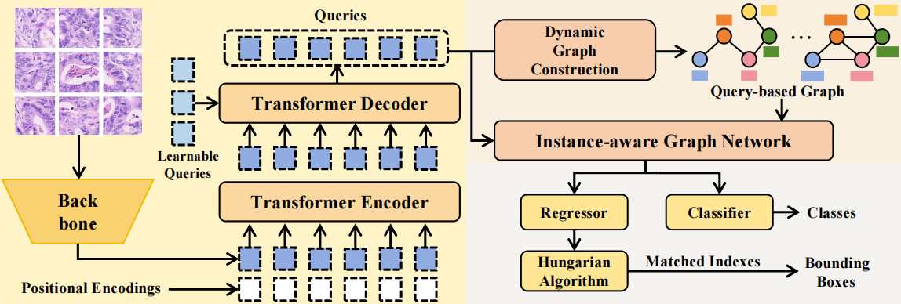

# Instance-aware Graph Modeling (IGM)

## End-to-End Cell Detection via Instance-aware Graph Modeling

We propose an end-to-end framework for cell detection and classification via an instance-aware graph, extending beyond visual representation to model the biological interactions among cells.



In contrast to such two-stage methods, our framework jointly optimizes graph learning and detection under a unified loss, modeling patch-level visual representations and instance-level interactions without stage-wise tuning.

The paper is currently under review. The core method implementation is released at this stage. The full code will be publicly available upon acceptance.

## Citation

If you find our work helpful, we'd be glad if you cite our paper:

```bibtex
@article{liu2026IGM,
  title={End-to-End Cell Detection via Instance-aware Graph Modeling},
  author={Ruochen Liu and Yalin Zheng and Jingxin Liu and Jianfeng Zhang and Shoujun Huang and Dexing Kong and Haofeng Li and Wei Lou},
  journal={arXiv preprint arXiv:2609.15354},
  year={2026}
}


